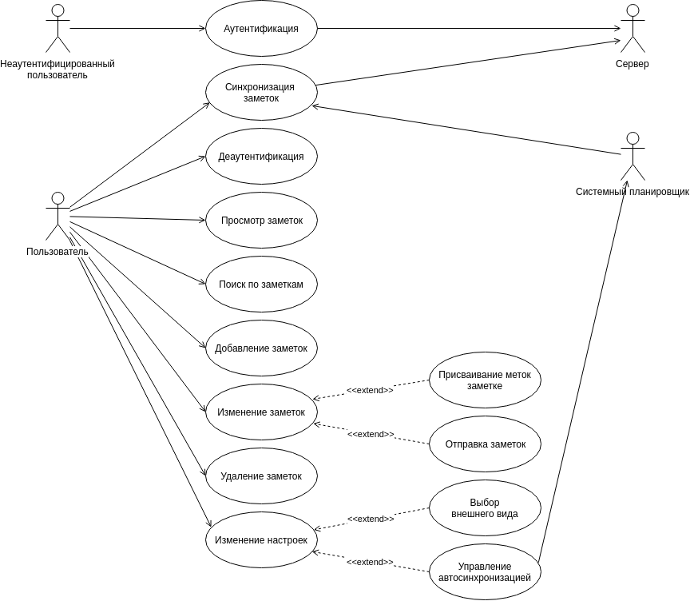
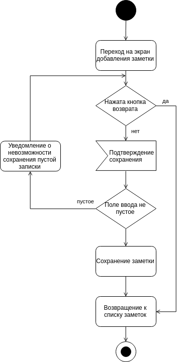
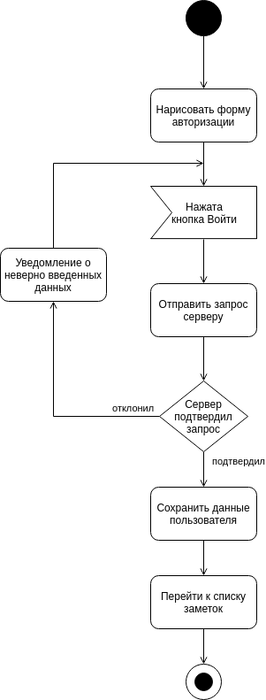
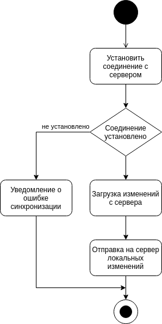
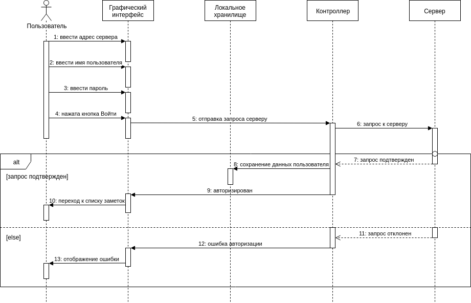
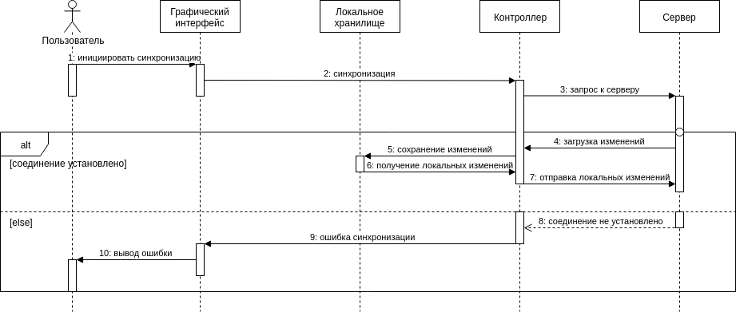

# Проектирование системы

1. [Диаграмма прецедентов](#1-диаграмма-прецедентов)  
1.1 [Поток событий](#11-поток-событий)  
1.1.1. [Актёры](#111-актёры)  
1.1.2. [Варианты использования](#112-варианты-использования)  
1.1.2.1. [Аутентификация](#1121-аутентификация)  
1.1.2.2. [Синхронизация заметок](#1122-синхронизация-заметок)  
1.1.2.3. [Автосинхронизация](#1123-автосинхронизация)  
1.1.2.4. [Деаутентификация](#1124-деаутентификация)  
1.1.2.5. [Просмотр заметок](#1125-просмотр-заметок)  
1.1.2.6. [Поиск по заметкам](#1126-поиск-по-заметкам)  
1.1.2.7. [Добавление заметок](#1127-добавление-заметок)  
1.1.2.8. [Изменение заметок](#1128-изменение-заметок)  
1.1.2.9. [Присваивание меток заметке](#1129-присваивание-меток-заметке)  
1.1.2.10. [Отправка заметок](#11210-отправка-заметок)  
1.1.2.11. [Удаление заметок](#11211-удаление-заметок)  
1.1.2.12. [Изменение настроек](#11212-изменение-настроек)  
1.1.2.13. [Выбор внешнего вида](#11213-выбор-внешнего-вида)  
1.1.2.14. [Управление автосинхронизацией](#11214-управление-автосинхронизацией)  
2. [Диаграммы активностей](#2-диаграммы-активностей)  
2.1. [Добавление заметки](#21-добавление-заметки)  
2.2. [Авторизация](#22-авторизация)  
2.3. [Синхронизация](#23-синхронизация)  
3. [Диаграммы последовательности](#3-диаграммы-последовательности)  
3.1 [Авторизация](#31-авторизация)  
3.2 [Синхронизация](#32-синхронизация)  

---

## 1. Диаграмма прецедентов

### 1.1. Поток событий

#### 1.1.1. Актёры

Актёр | Описание
----- | --------
Неаутентифицированный пользователь | Новый пользователь не прошедший процедуру аутентификации
Пользователь | Пользователь успешно прошедший процедуру аутентификации
Сервер | Веб-сервис для аутентификации, авторизации и хранения заметок
Системный планировщик | Сервис операционной системы, позволяющий планировать фоновую синхронизацию

#### 1.1.2. Варианты использования

#### 1.1.2.1. Аутентификация

Позволяет пройти аутентификацию для дальнейшего использования приложения.

Предусловия: пользователь не должен быть уже аутентифицирован.

#### Основной поток:
1. Вариант использования начинается если пользователь открыл приложение и не был аутентифицирован ранее.
2. В форме авторизации заполняются поля "Сервер", "Имя пользователь" и "Пароль".
3. Форма подтверждается нажатием кнопки "Войти".
4. Приложение отправляет запрос серверу для проверки введенных данных.
5. Сервер подтверждает запрос.
6. Приложение сохраняет данные аутентификации в локальное хралище.
7. Пользователь переходит к экрану управления заметками.
8. Вариант использования завершается.

#### Альтернативный поток:
5. Сервер отклоняет запрос.
6. Пользователь уведомляется о неверно введенных данных.
7. Вариант использования завершается.

#### 1.1.2.2. Синхронизация заметок

Загрузка с сервера и отправка на сервер добавленных, измененных и удаленных записок.

#### Основной поток:
1. Пользователь инициирует синхронизацию заметок жестом свайпа вниз в списке заметок.
2. Приложение устанавливает соединение с сервером.
3. Приложение получает с сервера изменения.
4. Приложение отправляет на сервере локальный изменения.
4. Вариант использования завершается.

#### Альтернативный поток:
2. Приложение не может установить соединение с сервером.
3. Пользователь уведомляется о невозможности синхронизации.
4. Вариант использования завершается.

#### 1.1.2.3. Автосинхронизация

Процесс синхронизации инициированный системным планировщиком.

#### Основной поток:
1. Системный планировщик отправляет запрос к приложению.
2. Приложение инициирует процесс синхронизации с сервером.
3. Вариант использования завершается.

#### 1.1.2.4. Деаутентификация

Удаление учетных данных из локального хранилища.

#### Основной поток:
1. Пользователь нажимает "Выйти" в боковом меню.
2. Приложение удаляет локально сохраненные данные пользователя.
3. Пользователю переходит на экран авторизации.
4. Вариант использования завершается.

#### 1.1.2.5. Просмотр заметок

Вывод заметок из локального хранилища.

#### Основной поток:
1. Пользователь открывает приложение.
2. Приложение загружает локально сохраненные заметки.
3. Заметки выводятся пользователю.
4. Вариант использования завершается.

#### Альтернативный поток:
2. Отсутствуют локально сохраненные заметки.
3. Пользователь уведомляется об отсутствии заметок.
4. Вариант использования завершается.

#### 1.1.2.6. Поиск по заметкам

Полнотекстовый поиск заметок.

#### Основной поток:
1. В меню навигации пользователь нажимает на знак поиска.
2. Пользователь переходит на экран поиска.
3. В поле ввода пользователь вводит часть текста искомой заметки.
4. Приложение выводит заметки содержащие введенную часть текста.
5. Вариант использования завершается.

#### Альтернативный поток:
4. Отсутствуют заметки содержащие введенную часть текста.
5. Пользователь информируются об отсутствии результатов поиска.
6. Вариант использования завершается.

#### 1.1.2.7. Добавление заметок

Добавление заметок в локальное хранилище.

#### Основной поток:
1. Пользователь нажимает на плавующую кнопку добавления заметки.
2. Пользователь переходит на экран добавления заметки.
3. Пользователь вводит текст заметки.
4. Пользователь подтверждает сохранение нажатием плавающей кнопки.
5. Записка сохраняется в локальном хранилище.
6. Пользователь возвращается к списку заметок.
7. Вариант использования завершается.

#### Альтернативный поток:
3. Пользователь нажимает на кнопку возврата в меню навигации.
4. Пользователь возвращается к списку заметок без сохранения.
5. Вариант использования заметки.

#### Альтернативный поток:
3. Пользователь оставляет поле ввода пустым.
4. Пользователь подтверждает сохранение нажатием плавающей кнопки.
5. Пользователь уведомляется о невозможности сохранения пустой заметки.
6. Вариант использования завершается.

#### 1.1.2.8. Изменение заметок

Изменение содержания и атрибутов заметки.

#### Основной поток:
1. В списке пользователь нажимает по заметке.
2. Открывается окно редактирования заметки.
3. Пользователь изменяет текст заметки.
4. Пользователь подтверждает сохранение нажатием плавающей кнопки.
5. Записка сохраняется в локальном хранилище.
6. Пользователь возвращается к списку заметок.
7. Вариант использования завершается.

#### Альтернативный поток:
3. Пользователь нажимает на кнопку возврата в меню навигации.
4. Пользователь возвращается к списку заметок без сохранения изменений.
5. Вариант использования заметки.

#### Альтернативный поток:
3. Пользователь очищает поле ввода.
4. Пользователь подтверждает сохранение нажатием плавающей кнопки.
5. Пользователь уведомляется о невозможности сохранения пустой заметки.
6. Вариант использования завершается.

#### 1.1.2.9. Присваивание меток заметке

Присваивание заметке уже существующих меток и добавление новых.

#### Основной поток:

1. Пользователь нажимает на метку в списке под меню навигации.
2. Нажата существующая метка.
3. Метка присваивается записке.
5. Вариант использования завершается.

#### Альтернативный поток:
2. Нажата кнопка новой метки.
3. Открывается диалог для ввода названия метки.
4. Метка добавляется в список и присваивается записке.
5. Вариант использования завершается.

#### 1.1.2.10. Отправка заметок

Отправка заметки с использованием системного диалога отправки.

#### Основной поток:
1. В меню навигации пользователь нажимает кпопку "Поделиться".
2. Открывается системный диалог для отправки заметки.
3. Вариант использования завершается.

#### 1.1.2.11. Удаление заметок

Удаление заметки из локального хранилища.

#### Основной поток:
1. В списке заметок пользователь делает жест "свайпа" на заметке.
2. Заметка убирается из списка.
3. Приложение удаляет заметку из локального хранилища.
4. Пользователь уведомляется об удалении заметки.
5. Вариант использования завершается.

#### 1.1.2.12. Изменение настроек

Управление оформлением и поведения приложения.

#### Основной поток:
1. Пользователь открывает боковое меню.
2. Пользователь изменяет значение настройки.
3. Приложение сохраняет значение.
4. Вариант использования завершается.

#### 1.1.2.13. Выбор внешнего вида

Управление оформлением приложения.

#### Основной поток:
1. Пользователь изменяет значение настройки "Темная тема".
2. Приложение изменяет оформление на соответствующее значению.
3. Вариант использования завершается.

#### 1.1.2.14. Управление автосинхронизацией

Включение и отключение автосинхронизации.

#### Основной поток:
1. Пользователь изменяет значение настройки "Автосинхронизация".
2. Автосинхронизация включена.
3. Активируется системный планировщик для приложения.
4. Вариант использования завершается.

#### Альтернативный поток:
2. Автосинхронизация выключена.
3. Отключается системный планировщик для приложения.
4. Вариант исопльзвоания завершается.

## 2. Диаграммы активностей

### 2.1. Добавление заметки

### 2.2. Авторизация

### 2.3. Синхронизация

## 3. Диаграммы последовательности

### 3.1. Авторизация

### 3.2 Синхронизация

