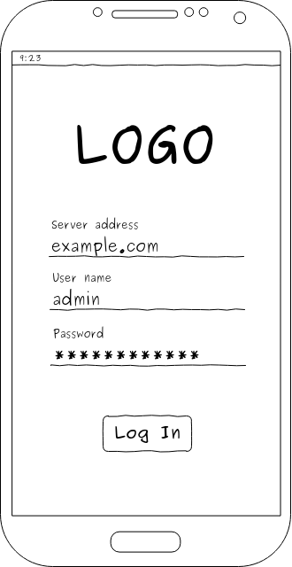
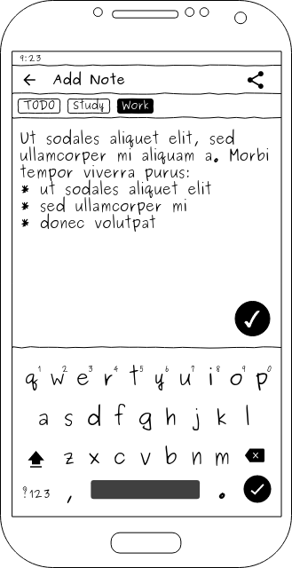
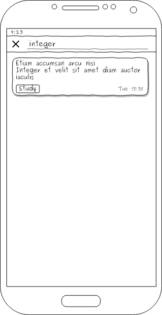
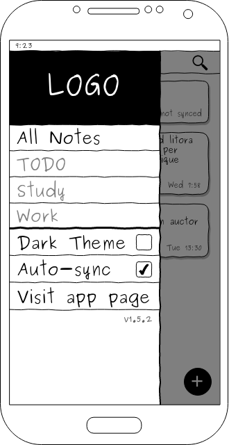

# Спецификация требований ПО

1. [Введение](#1-введение)  
1.1. [Назначение](#11-назначение)  
1.2. [Определения](#12-определения)  
1.3. [Ссылки](#13-ссылки)  
1.4. [Сравнение с аналогами](#14-сравнение-с-аналогами)  
2. [Требования пользователя](#2-требования-пользователя)  
2.1. [Программные интерфейсы](#21-программные-интерфейсы)  
2.2. [Интерфейс пользователя](#22-интерфейс-пользователя)  
2.3. [Характеристики пользователя](#23-характеристики-пользователя)  
2.4. [Предположения и зависимости](#24-предположения-и-зависимости)  
3. [Системные требования](#3-системные-требования)  
3.1. [Функциональная требования](#31-функциональная-требования)  
3.1.1. [Управление заметками](#311-управление-заметками)  
3.1.1.1. [Добавление заметок](#3111-добавление-заметок)  
3.1.1.2. [Изменение заметок](#3112-изменение-заметок)  
3.1.1.3. [Удаление заметок](#3113-удаление-заметок)  
3.1.1.4. [Поиск по заметкам](#3114-поиск-по-заметкам)  
3.1.1.5. [Организация заметок с помощью меток](#3115-организация-заметок-с-помощью-меток)  
3.1.1.6. [Отправка заметок через другие приложения](#3116-отправка-заметок-через-другие-приложения)  
3.1.1.7. [Синхронизация заметок](#3117-синхронизация-заметок)  
3.1.2. [Управление учетной записью](#312-управление-учетной-записью)  
3.1.2.1. [Аутентификация на сервере](#3121-аутентификация-на-сервере)  
3.1.2.2. [Деаутентификация](#3122-деаутентификация)  
3.1.3. [Настройки приложения](#313-настройки-приложения)  
3.1.3.1. [Внешний вид](#3131-внешний-вид)  
3.1.3.2. [Автоматическая синхронизация](#3132-автоматическая-синхронизация)  
3.2. [Нефункциональные требования](#32-нефункциональные-требования)  
3.2.1. [Атрибуты качества](#321-атрибуты-качества)  
3.2.1.1. [Целостность данных](#3211-целостность-данных)  
3.2.1.2. [Надежная синхронизация](#3212-надежная-синхронизация)  
3.2.1.3. [Конфиденциальность информации](#3213-конфиденциальность-информации)  

---

## 1. Введение

### 1.1 Назначение

Мобильное приложение **LibreNotes** является менеджером заметок. Оно позволяет синхронизировать заметки с другими устройствами через общий сервер. В отличии от множества аналогичных приложений, исходный код публично доступен, а серверную часть можно использовать на собственном сервере (см. [1.4. Сравнение с аналогами](#14-сравнение-с-аналогами)).

### 1.2 Определения

**Dart** - язык программирования для кроссплатформенных клиентских приложений. Разработан Google как замена **JavaScript**.

**Flutter** - SDK для разработки кроссплатформенных мобильных приложений (ОС Android и iOS). Унифицированное API доступно на языке программирования **Dart**.

**Django** - фреймворк для разработки веб-приложений на языке программиронивая Python. Предоставляет большинство необходимых компонентов для веб-приложений: ORM, шаблонизатор, роутинг, обработка форм, аутентификация и авторизация пользователей, интернационализация и прочие.

**REST** - архитектурный стиль проектирования программных интерфейсов веб-сервисов. Использует протокол HTTP: ресурс определяется с помощью URL, а операция над ним - HTTP-методом.

**Self-hosting** - самостоятельная настройка и администрирование приложения на собственном сервере. Производится с целью повышения сохранности информации, но защиту и поддержку сервера приходится производить самостоятельно.

**Material Design** - стиль дизайна приложений от Google. Рекомендован к использованию при разработке приложений для ОС Android начиная с 5-ой версии. Отличительными особенностями являются отсутствие острых углов, плавность анимаций, использование эффектов глубины - подсветка и тень.

### 1.3 Ссылки

1. Material Design Guidelines: https://material.io/design/guidelines-overview/
2. Системные требования Flutter: https://flutter.dev/docs/resources/faq#what-devices-and-os-versions-does-flutter-run-on
3. Flutter для Web: https://flutter.dev/web
4. Flutter для Desktop: https://github.com/flutter/flutter/wiki/Desktop-shells

## 1.4 Сравнение с аналогами

Рассматриваться будут только приложения:

* поддерживающие платформу Android
* с открытым исходным кодом
* имеющие возможность синхронизации заметок
* позволяющие поддерживать сервер самостоятельно (т.н. self-host server)

Сравнение с аналогами будет производиться по следующим критериям:

* поддержка других платформ (кроме Android)
* поддерживается ли приложение на данный момент
* соответствие пользовательского интерфейса стандарту [Material Design Guidelines](https://material.io/design/guidelines-overview/) [1]

Приложение | Платформы | Поддержка | Дизайн интерфейса | Примечание
----------:| --------- | --------- | ----------------- | ----------
LibreNotes | Android, iOS | В разработке | Material Design |
Joplin | Windows, Linux, Mac, Android, iOS | Поддерживается сообществом | Не соответствует Style Guide | Отсутствует сервер синхронизации - разрешение конфликтов синхронизации невозможно
Standard Notes | Web, Windows, Linux, Mac, Android, iOS | Поддерживается разработчиком | Собственный стиль | Большая часть функциональности доступна лишь в платной проприетарной версии
Turtl | Windows, Linux, Mac, Android | Не поддерживается - последний коммит 6 месяцев назад | Не соответствует Style Guide |

## 2. Требования пользователя

### 2.1. Программные интерфейсы

Приложение разрабатывается на языке программирования Dart с использованием технологии Flutter.

Сервер написан на Python с использованием веб-фреймворка Django и Django Rest Framework. Общение клиента с сервером происходит с использованием REST-like протокола.

### 2.2. Интерфейс пользователя

Работа с приложением начинается с аутентификации на сервере:

Рис. 1. Авторизация

 

После аутентификации пользователю доступен просмотр его заметок:

Рис. 2. Список заметок

 

Также можно добавлять новые заметки или редактировать существующие:

Рис. 3. Добавление заметки

 

Присутствует возможность полнотекстового поиска:

Рис. 4. Поиск по заметкам

 

В боковом меню доступна фильтра по меткам и настройки приложения:

Рис. 5. Настройки

### 2.3. Характеристики пользователя

Использование приложения не требует специализированного образования или опыта. Однако настройка сервера подразумевает навыки администрирования компьютерных систем.

### 2.4. Предположения и зависимости

Целевой платформой является ОС Android версии 4.1 и новее (см. [Системные требования Flutter](https://flutter.dev/docs/resources/faq#what-devices-and-os-versions-does-flutter-run-on) [2]), однако есть возможность сборки приложения для iOS.

Разработчиками Flutter ведется работа  по разработке SDK для сборки Flutter-приложений на Desktop (Linux, Mac, Windows) и Web платформы (см. [Flutter для Web](https://flutter.dev/web) [3] и [Flutter для Desktop](https://github.com/flutter/flutter/wiki/Desktop-shells) [4]). Это может быть использовано для портирования данного приложения на другие платформы в будущем.

Приложение не поддерживает оффлайн-синхронизацию, т.е. синхронизацию по альтернативным каналам связи (USB, Bluetooth и прочие).

## 3. Системные требования

### 3.1. Функциональная требования

#### 3.1.1. Управление заметками

##### 3.1.1.1. Добавление заметок

Пользователь может добавлять заметки нажатием на плавающую кнопку (рис. 2). В появившемся окне редактирования (рис. 3) выбираются метки и вводится текст заметки. Подтверждается добавление нажатием плавающей кнопки.

##### 3.1.1.2. Изменение заметок

Изменение заметок происходит аналогично их редактированию, но для вызова окна редактирования пользователь нажимает по заметке.

##### 3.1.1.3. Удаление заметок

Удаление заметок происходит свайпом (жест смахивания) заметки влево или вправо.

##### 3.1.1.4. Поиск по заметкам

Для поиска заметок пользователь может воспользоваться полнотекстовым поиском. Для этого он в списке заметок нажимает по значку поиска (рис. 2). В появившееся поле поиска вводится часть текста искомой заметки (рис. 4). Для закрытия поиска используется кнопка отмены.

##### 3.1.1.5. Организация заметок с помощью меток

Пользователь может происваивать каждой заметке одну и более меток. Для этого при редактировании заметки (рис. 3) пользователь добавляет метку нажатием по ней.

Для фильтрации заметок по метке, пользователь в боковом меню выбирает соответствующую метку (рис. 5). Отменить фильтрацию можно выбрав в меню первый пункт "Все заметки".

##### 3.1.1.6. Отправка заметок через другие приложения

При редактировании заметки (рис. 3) пользователь может поделиться ею. Для этого он нажимает кнопку поделиться, в системном диалоге выбирает приложение и в нем указывает контакты, с которыми он желает поделиться заметкой.

##### 3.1.1.7. Синхронизация заметок

Заметки синхронизируется при наличии подключения к интернету. Процесс синхронизации включает отправку изменений, выполненных на этом устройстве, и получение изменений с других устройств. Этот процесс происходит прозрачно для пользователя (его вмешательство не требуется).

При отключенной автоматический синхронизации, пользователь может принудительно синхронизировать изменения свайпом (жест смахивания) вниз в списке заметок (рис. 2).

#### 3.1.2. Управление учетной записью

##### 3.1.2.1. Аутентификация на сервере

При первом запуске приложения пользователю будет предложено указать сервер, логин и пароль (рис. 1). После ввода данных и их подтверждения пользователь перейдет к списку заметок.

##### 3.1.2.2. Деаутентификация

В боковом меню (рис. 5) присутствует возможность деаутентификации пользователя. Пользователь будет предупрежден о безвозвратном удалении несинхронизированных изменений. После подтверждения он перейдет к интерфейсу аутентификации (рис. 1).

#### 3.1.3. Настройки приложения

##### 3.1.3.1. Внешний вид

Пользователь может выбрать светлое или темное оформление приложения в боковом меню (рис. 5). Выбранное значение сохраняется до следующего изменения (нет необходимости изменять оформление после каждого запуска приложения).

##### 3.1.3.2. Автоматическая синхронизация

Для экономии трафика пользователь может отключить автоматическую синхронизацию (рис. 5).

### 3.2. Нефункциональные требования

#### 3.2.1. Атрибуты качества

##### 3.2.1.1. Целостность данных

Заметки не должны быть утеряны при ошибках синхронизации или взаимодействии с базой данных.

##### 3.2.1.2. Надежная синхронизация

Пользователь должен иметь информацию синхронизирована ли заметка. При ошибке синхронизации (нестабильное соединение, недоступность сервера, конкурентные изменения) пользователь должен быть осводомлен о проблеме.

##### 3.2.1.3. Конфиденциальность информации

Заметки должны быть доступны лишь авторизированным пользователям.
